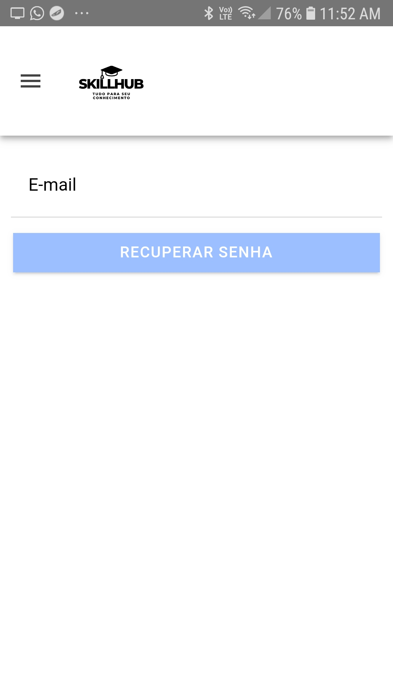
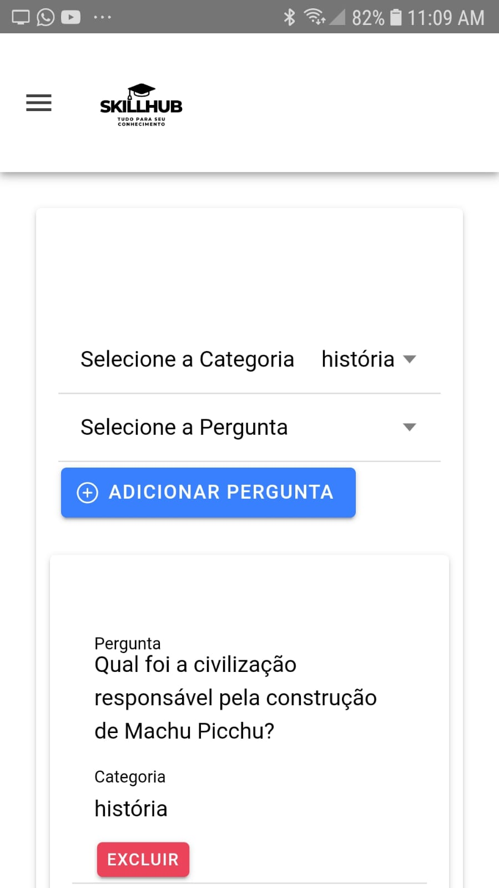
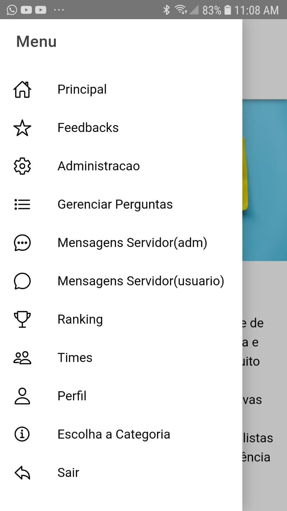

# Projeto SkillHub 

- [Meu APK](#meu-apk)
- [Descrição do Projeto](#descrição-do-projeto)
- [Funcionalidades](#funcionalidades)
- [Tecnologias Utilizadas](#tecnologias-utilizadas)
- [Como funciona](#como-funciona)
- [Como rodar o projeto](#como-rodar-o-projeto)
- [Telas do Aplicativo](#telas-do-aplicativo)
- [Telas do Aplicativo Imagens](#telas-do-aplicativo-imagens)

## Descrição do Projeto

O SkillHub é um aplicativo que tem como objetivo criar formas divertidade de aprendizado, nesta nossa primeira versão do aplicativo, estamos com o nosso quiz de perguntas e respostas, onde o usuário pode responder perguntas de diversos temas e testar seus conhecimentos.

## Funcionalidades

- [x] Cadastro de usuário
- [x] Login de usuário
- [x] Recuperação de senha
- [x] Alteração de dados
- [x] Conta de usuário
- [x] Conta de Admin
- [x] Envio de feedback
- [x] Criação de perguntas
- [x] Responder perguntas
- [x] Visualizar pontuação
- [x] Visualizar ranking
- [x] Entrar em Times 
- [x] Criar Times
- [x] Visualizar Times
- [x] Visualizar membros do Time
- [x] Visualizar pontuação do Time
- [x] Enviar mensagem para o Admin
- [x] Visualizar mensagens enviadas pelo usuário
- [x] Enviar mensagem para o usuário
- [x] Bloquear e desbloquear usuário
- [x] Enviar mensagem para todos usuários
- [x] Enviar mensagem para usuário específico

## Tecnologias Utilizadas

### No Aplicativo
- [x] Ionic
- [x] Angular
- [x] Firebase
- [x] Firestore

### Na Nossa API
- [x] Node.js
- [x] Express
- [x] MongoDB
- [x] Typescript

## Como funciona

O Aplicativo acessa o banco de dados Firebase para realizar o login e cadastro de usuários, e o banco de dados MongoDB é utilizado em conjunto com a nossa API para salvar e carregar mensagens enviadas tanto para o administrador, quanto para o usuário, Utilizando API REST.

## Como rodar o projeto

- Baixe o nosso APK e instale no seu dispositivo Android

# Meu APK
- # [Apk](app-debug.apk)

# Telas do Aplicativo

- [x] Tela de Login
- [x] Tela de Cadastro
- [x] Tela de Recuperação de Senha
- [x] Tela de Home
- [x] Tela de Quiz
- [x] Tela de Ranking
- [x] Tela de Selecionar Categoria
- [x] Tela de Alteração de Dados
- [x] Tela de Perfil 
- [x] Tela de Feedback
- [x] Tela de Times
- [x] Tela de Criar Time
- [x] Tela do Usuário enviar mensagem para o Admin
- [x] Tela do Admin visualizar mensagens enviadas pelo usuáro
- [x] Tela de Admin Enviar mesangem para usuários
- [x] Tela de Admin visualizar todos usuários
- [x] Tela de Admiistração
- [x] Tela de Admin Criar e Gerenciar Perguntas

# Telas do Aplicativo Imagens 

- [x] Tela de Login

- [x] Tela de Cadastro

- [x] Tela de Recuperação de Senha

- [x] Tela de Home

- [x] Tela de Quiz
    

- [x] Tela de Ranking

- [x] Tela de Selecionar Categoria

- [x] Tela de Alteração de Dados

- [x] Tela de Perfil

- [x] Tela de Feedback

- [x] Tela de Times

- [x] Tela de Criar Time

- [x] Tela do Usuário enviar mensagem para o Admin

- [x] Tela do Admin visualizar mensagens enviadas pelo usuáro

- [x] Tela de Admin Enviar mesangem para usuários

- [x] Tela de Admin visualizar todos usuários

- [x] Tela de Admiistração

- [x] Tela de Admin Criar e Gerenciar Perguntas

